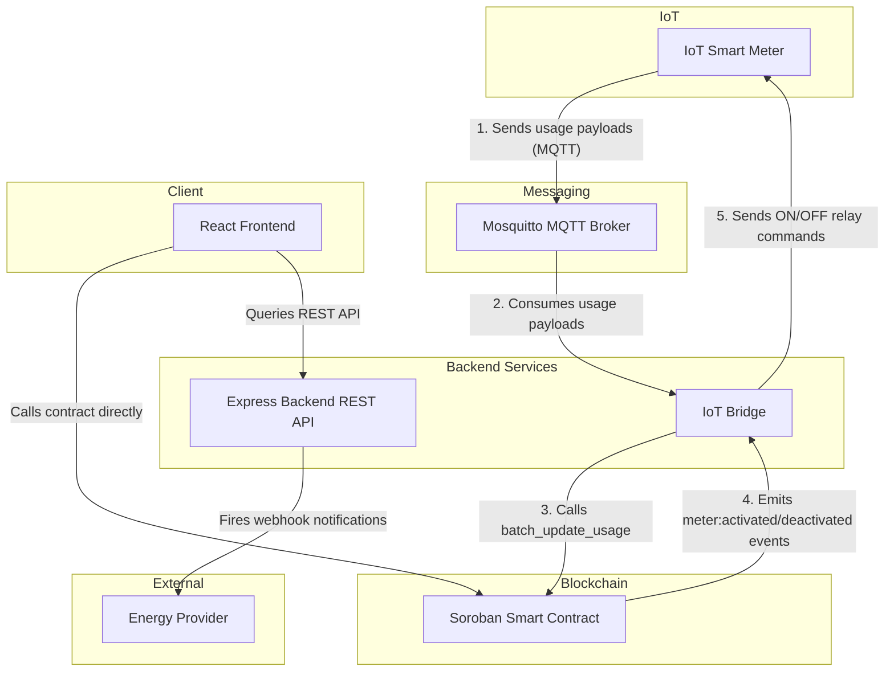

# Stellar SolarGrid

[](https://github.com/Dev-AdeTutu/Stellar-Solar-Grid/actions/workflows/ci.yml)
[](https://github.com/Dev-AdeTutu/Stellar-Solar-Grid/actions/workflows/backend-test.yml)

> Powering Africa with affordable, pay-as-you-go solar energy on blockchain.

Stellar SolarGrid is a decentralized PAYG solar energy platform built on [Soroban](https://soroban.stellar.org), within the Stellar ecosystem. Households and small businesses in underserved regions access solar electricity through flexible micro-payments — no large upfront costs required.

## Architecture



### System Flows

#### 1. PAYG (Pay-As-You-Go) Flow
Users purchase energy access through flexible payment plans (daily, weekly, or usage-based stablecoin payments) via the React Frontend dashboard, which interacts directly with the Soroban smart contract. The contract verifies the payment, activates the user's meter, and tracks the remaining energy units or time validity.

#### 2. Batch Update Flow
Rather than updating every usage update individually, the IoT Bridge consumes MQTT payloads sent by active smart meters to the Mosquitto broker, aggregates them, and calls `batch_update_usage` on the Soroban smart contract in a single batch transaction. This saves gas and transaction fees on the Stellar network.

#### 3. Allowlist Flow
To prevent unauthorized usage reports or unauthorized meter controls, an Allowlist checks and verifies that only registered smart meters (registered via the admin CLI/dashboard) can be active on the system. Additionally, the IoT Bridge/Oracle address is allowlisted on the smart contract to restrict usage updates to trusted nodes.

For local development setup and contributing guidelines, please refer to the [Contributing Guide](CONTRIBUTING.md). For help with common errors, see the [Troubleshooting Guide](TROUBLESHOOTING.md).

## Core Features

- **Smart Meter Integration** — IoT meters with real-time usage monitoring and on/off control
- **Flexible Payment Plans** — Daily, weekly, or usage-based micro-payments in stablecoins
- **Automated Access Control** — Smart contracts enable/disable electricity based on payment status
- **Energy Usage Tracking** — Dashboards for users and providers

## Getting Started

### Prerequisites

- [Rust](https://rustup.rs/) + `wasm32-unknown-unknown` target
- [Stellar CLI](https://developers.stellar.org/docs/tools/developer-tools/cli/stellar-cli)
- Node.js >= 18
- [Freighter Wallet](https://freighter.app/) (browser extension)

### Development with Makefile

A Makefile is provided at the repository root to simplify common development and smart contract deployment/invocation commands:

- **Build contracts**: `make build` compiles the contracts into WASM.
- **Run tests**: `make test` executes Cargo tests in the contracts folder.
- **Clean builds**: `make clean` runs `cargo clean` inside the contracts directory.
- **Deploy contract**: `make deploy NETWORK=testnet ADMIN_SECRET_KEY=<key>` deploys the built contract WASM to the specified network.
- **Invoke functions**:
  - `make invoke-register CONTRACT_ID=<id> ADMIN_SECRET_KEY=<key> METER_ID=<meter_id> OWNER=<owner>` registers a new meter.
  - `make invoke-allowlist CONTRACT_ID=<id> ADMIN_SECRET_KEY=<key> OWNER=<owner>` adds an owner to the allowlist.
- **Bulk migrate all meters**: `make migrate-all CONTRACT_ID=<id> ADMIN_SECRET_KEY=<key>` — see [Contract Upgrades](#contract-upgrades) below.
- **Backend Logs**: `make logs` streams Docker Compose logs for the backend.

### Smart Contracts Deployment CI/CD

Contract deployments to the Stellar Testnet are automated via GitHub Actions:
- To trigger a deployment, push a git tag matching the pattern `contract-v*` (e.g., `git tag contract-v1.0.0 && git push origin contract-v1.0.0`).
- The workflow compiles the contract, installs Stellar CLI, and deploys it to the testnet using the `ADMIN_SECRET_KEY` secret.
- The new contract ID is printed as an output of the workflow.

### Running with Docker Compose and GHCR Images

You can pull and run the backend and frontend Docker images built automatically on pushes to `main` and release tags (`v*`):

```bash
docker pull ghcr.io/OWNER/solargrid-backend:latest
docker pull ghcr.io/OWNER/solargrid-frontend:latest
```
(Replace `OWNER` with the GitHub organization or username).

You can spin up the local infrastructure (MQTT broker and the backend service) using Docker Compose:

1. Copy the environment template at the repository root:
   ```bash
   cp .env.example .env
   ```
2. Populate the `.env` file — at minimum set `CONTRACT_ID`, `ADMIN_SECRET_KEY`, `ADMIN_ADDRESS`, and `VITE_CONTRACT_ID`. Every variable is documented with an inline comment in `.env.example`.
3. Start the services:
   ```bash
   docker compose up --build
   ```

The `env-check` service validates that all required environment variables are correctly populated before the backend starts up, preventing silent configuration errors.

### Observability

You can run the Prometheus and Grafana observability stack alongside the backend and MQTT services using the `observability` profile:

```bash
docker compose --profile observability up --build
```

- **Prometheus** scrapes the backend metrics endpoint (`GET /metrics`) every 15 seconds via `infra/prometheus.yml`, and is accessible at `http://localhost:9090`.
- **Grafana** is preconfigured with the Prometheus datasource and is accessible at `http://localhost:3000` (default credentials: `admin` / `admin`). It features dashboard panels for MQTT messages/min, contract calls by method/status, and error rates.

#### `/metrics` — intentionally public (closes #537)

The `GET /metrics` endpoint exposes Prometheus text-format data with **no authentication**. This is by design: Prometheus's pull model requires unauthenticated HTTP GET access to scrape metrics from a target.

**Why this is safe in the default deployment:** the backend container port `3001` is attached only to the internal Docker `app-network` and is not forwarded to a public interface. The Prometheus container scrapes it from within that private network. External traffic never reaches `/metrics`.

**If you expose the backend on a public port** (e.g. via a reverse proxy or `ports: "3001:3001"` in `docker-compose.override.yml`), you should restrict access to `/metrics` at the proxy layer — for example:

```nginx
# nginx — deny external access to /metrics
location /metrics {
    deny all;
}
```

Or allow only the Prometheus container's IP via a firewall rule. A `METRICS_ALLOWED_CIDRS` env-var-driven IP-allowlist middleware can also be added to `backend/src/index.ts` in a future hardening pass.

#### Distributed tracing (closes #763)

The backend can export OpenTelemetry traces — one span per HTTP request plus child spans for each Stellar RPC call (`stellar.invoke`/`stellar.query`) — via OTLP/HTTP. It's off by default; enable it with `OTEL_ENABLED=true` (or simply set `OTEL_EXPORTER_OTLP_ENDPOINT`) in `backend/.env`, then bring up Jaeger alongside the stack:

```bash
docker compose --profile observability up --build
```

- **Jaeger** accepts OTLP/HTTP directly on `:4318` and serves its UI at `http://localhost:16686` — search by service name `solargrid-backend` to see a request's full path, including which Stellar RPC calls it made and how long they took.
- Every response also carries an `X-Trace-Id` header (correlates with the `X-Request-ID` already in logs) so a slow/failed request reported in the UI can be looked up directly in Jaeger.
- The frontend generates and propagates a W3C `traceparent` header on its backend API calls (`frontend/src/lib/tracing.ts`), so a trace started by a button click continues into the backend span for that request instead of starting a new, disconnected one.

#### Stellar RPC circuit breaker (closes #761)

All Stellar RPC traffic goes through a shared [opossum](https://github.com/nodeshift/opossum) circuit breaker (`backend/src/lib/circuitBreaker.ts`). If the RPC network is down or slow enough that requests keep failing, the breaker opens after `RPC_CIRCUIT_FAILURE_THRESHOLD` consecutive failures (default 5) and stops sending new requests for `RPC_CIRCUIT_RESET_MS` (default 30s), instead of every request separately waiting out its own timeout against a struggling endpoint:

- **Read-only queries** (`stellarService.query`) fall back to the last successful cached result for that query while the breaker is open.
- **Writes and uncached queries** fail fast with `503 { code: "CIRCUIT_OPEN" }` instead of blocking.
- Breaker state is visible at `GET /health` (`rpcCircuitBreaker: "closed" | "half-open" | "open"`) and in Prometheus (`solargrid_rpc_circuit_breaker_state`, `solargrid_rpc_circuit_breaker_trips_total`).

This sits above, and is complementary to, the per-endpoint failover already in `RpcPool` (`backend/src/lib/rpcPool.ts`): `RpcPool` decides which of several configured RPC URLs to try next; this breaker decides whether to attempt a Stellar RPC call at all once the pool's failover options are exhausted and calls are still failing.

#### Fee safety margin for large batches (closes #762)

`simulateTransaction`'s resource-fee estimate is a point-in-time snapshot; actual execution cost can drift by submission time (e.g. rent bumps on entries touched by the operation), and that drift scales with how many ledger entries the operation touches — which is why large batch calls like `batch_update_usage` over 80+ meters used to fail with "insufficient fee" even with a fresh estimate.

Both the admin-signed backend path (`backend/src/lib/stellar.ts`) and the wallet-signed frontend path (`frontend/src/lib/contract.ts`) now pad the assembled fee by a percentage margin before signing/submitting, so the cushion scales with the operation instead of needing a manual 2x multiplier:

- Backend: `RPC_FEE_SAFETY_MARGIN_PCT` (default 20, see `backend/.env.example`).
- Frontend: `NEXT_PUBLIC_FEE_SAFETY_MARGIN_PCT` (default 20, see `frontend/.env.example`).

#### White-label branding (closes #764)

Energy providers running their own deployment of the dashboard can customize branding without forking the UI, via `NEXT_PUBLIC_BRAND_*` env vars (see `frontend/.env.example` and `frontend/src/lib/branding.ts`):

| Variable | Effect |
|---|---|
| `NEXT_PUBLIC_BRAND_NAME` | Shown in the navbar and page title. |
| `NEXT_PUBLIC_BRAND_LOGO_URL` | Logo image shown in the navbar in place of the default emoji. |
| `NEXT_PUBLIC_BRAND_PRIMARY_COLOR` / `NEXT_PUBLIC_BRAND_SECONDARY_COLOR` | Hex colors applied as the `--color-brand-primary`/`--color-brand-secondary` CSS custom properties (see `globals.css`) that drive the `solar.yellow`/`solar.secondary` Tailwind colors app-wide. |
| `NEXT_PUBLIC_BRAND_FOOTER_TEXT` | Custom footer text; defaults to a copyright line using the configured brand name. |

All are optional with sensible defaults matching the built-in SolarGrid look. This is deployment-time configuration rather than a database-backed settings UI — there's no multi-tenant provider model in this app, just one deployment per provider, so a logo *URL* (rather than an upload-and-store pipeline) and env vars (rather than new storage/auth surface) match how the rest of the app is already configured (fee margins, rate limits, circuit breaker thresholds, etc.).

## Smart Contract Overview

The `SolarGrid` contract manages:

| Function | Description |
|---|---|
| `register_meter(meter_id, owner)` | Register a new smart meter |
| `make_payment(meter_id, amount, plan)` | Pay for energy access |
| `check_access(meter_id)` | Check if meter is currently active |
| `get_usage(meter_id)` | Retrieve usage data |
| `update_usage(meter_id, units)` | Called by IoT oracle to update consumption |
| `deactivate_meter(meter_id)` | Admin-only: immediately deactivate a meter |
| `batch_deactivate_meters(meter_ids)` | Admin-only: deactivate multiple meters in a single transaction |

## Backend API

The full machine-readable API specification is available at [`backend/openapi.yaml`](backend/openapi.yaml) (OpenAPI 3.1). You can preview it with:

```bash
npx @redocly/cli preview-docs backend/openapi.yaml
```

### Meter Balance

**`GET /api/meters/:id/balance`**

Returns the live balance, usage, and active status for a single meter. Responses are cached for 5 seconds to reduce RPC load. The frontend `UserDashboard` polls this endpoint every 30 seconds.

**Response**

```json
{
  "meter_id": "METER1",
  "balance": 5000000,
  "units_used": 1200,
  "active": true
}
```

| Status | Description |
|---|---|
| 200 | Meter found, returns balance data |
| 404 | Meter not found |

## Contract Upgrades

The `Meter` struct carries a `version: u32` field (currently `1`). When the struct layout changes in a future release, existing persistent storage entries must be migrated before they can be read by the new code.

### Migration flow

1. Deploy the new contract WASM (the old entries remain in persistent storage).
2. Run the bulk migration helper to migrate every registered meter in one pass:

   ```bash
   # Recommended: migrate all meters at once (closes #536)
   make migrate-all CONTRACT_ID=<id> ADMIN_SECRET_KEY=<key> NETWORK=testnet
   ```

   The script calls `get_all_meters` to fetch every registered meter ID, then
   calls `migrate_meter(meter_id)` for each one, logging per-meter
   success/failure and printing a final summary.  Exit code is `0` only when
   all meters succeed, so it integrates cleanly into CI pipelines.

   ```bash
   # Dry-run: list meters without sending any transactions
   make migrate-all CONTRACT_ID=<id> ADMIN_SECRET_KEY=<key> DRY_RUN=true
   ```

3. Alternatively, migrate a single meter manually via the Stellar CLI:

   ```bash
   stellar contract invoke \
     --id <CONTRACT_ID> \
     --source <ADMIN_SECRET> \
     --network testnet \
     -- migrate_meter --meter_id METER1
   ```

4. Once all entries are migrated, the `LegacyMeter` type and `migrate_meter_v0` helper can be removed in a subsequent release.

> **Note:** `migrate_meter` is idempotent per entry — calling it on an already-migrated meter will overwrite with the same data. Always test migrations on testnet before mainnet.

## Network

Deployed on Stellar Testnet. Switch to Mainnet for production.

## Deployment Security

- **Never commit `.env` files.** Copy `.env.example` to `.env` and populate locally.
- `ADMIN_SECRET_KEY` is loaded once at backend startup into a `Keypair` object; the raw secret string is not referenced anywhere after module initialisation.
- All error handlers log only `err.message` — raw error objects (which may contain XDR or serialised environment variables) are never logged.
- Enable secret scanning in CI (e.g. `git-secrets`, GitHub secret scanning) to prevent accidental key commits.

## License

MIT
